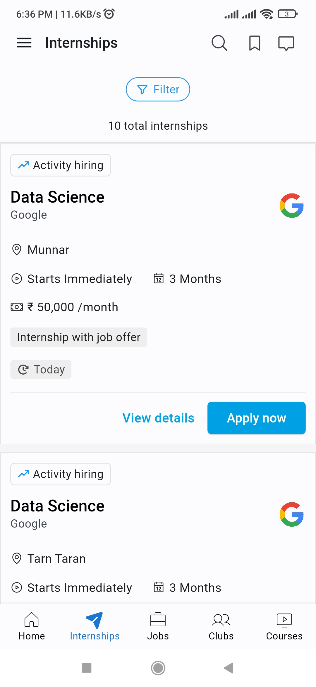

# Internshala

[](https://github.com/subrotokumar/internshala/stargazers)
[](https://github.com/subrotokumar/internshala/network)
[](https://github.com/subrotokumar/internshala/issues)
[](https://github.com/subrotokumar/internshala/blob/main/LICENSE)

> Trusted by 21 million College students & Graduates.

## Table of Contents

- [Features](#features)
- [Screenshots](#screenshots)
- [Architecture](#architecture)
- [Getting Started](#getting-started)
  - [Prerequisites](#prerequisites)
  - [Installation](#installation)
- [Usage](#usage)
- [Contributing](#contributing)
- [License](#license)

## Features

- **Technology Used**:

  

  Packages used: **Dio**, **Retrofit**, **Riverpod**

- **Clean Architecture**:
  Project adheres to the principles of Clean Architecture, promoting a clear separation of concerns between the business logic, presentation layer, and data sources.

## Screenshots

&nbsp;&nbsp;&nbsp;
&nbsp;&nbsp;&nbsp;
<br><br>
&nbsp;&nbsp;&nbsp;


## Architecture

- 📦 **lib**
  - 📂 **config**
  - 📂 **core**
  - 📂 **feature**
    - 📂 **feature_1**
    - 📂 **feature_2**
      - 📂 **data**
        - 📂 **models**
        - 📂 **repositories**
        - 📂 **source**
          - 📂 **remote**
          - 📂 **local**
      - 📂 **domain**
        - 📂 **entities**
        - 📂 **repositories**
        - 📂 **usecase**
      - 📂 **presentation**
        - 📂 **providers**
        - 📂 **screens**
        - 📂 **widgets**
  - 📄**app.dart**
  - 📄**main.dart**

## Getting Started

### Prerequisites

- List any prerequisites here. For example:
  - [Flutter](https://flutter.dev/docs/get-started/install)
  - [Dart](https://dart.dev/get-dart)

### Installation

```sh
git clone https://github.com/subrotokumar/internshala.git

cd internshala

dart run build_runner build --delete-conflicting-outputs

flutter run
```
